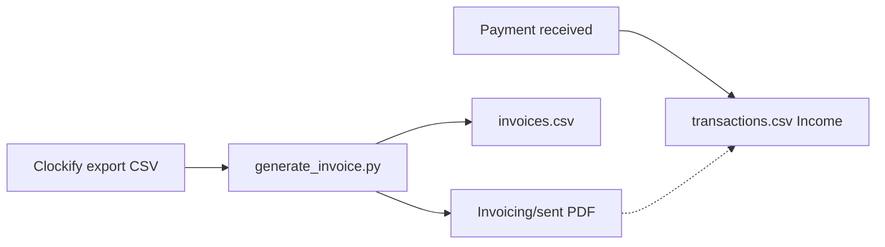

# Invoice tracking process for Fresh Roots

## What your folder shows today

- **Dustin Budd (Lumen & Legacy Financial, LLC)** appears only in [Organization/Clockify/processed/Clockify_Time_Report_Detailed_01_01_2026-31_12_2026.csv](Organization/Clockify/processed/Clockify_Time_Report_Detailed_01_01_2026-31_12_2026.csv): **9 billable rows**, **10.5 hours**, **$1,575.00** total (Jan 17–28, 2026, $150/hr), project *Business Purchase Analysis*.
- **No invoice PDF** is in git under [Organization/Clockify/](Organization/Clockify/) (no `2026/01/` output folder). So the “sent” invoice likely lives in email, Downloads, or another machine—not in this workspace.
- [Organization/Transactions/transactions.csv](Organization/Transactions/transactions.csv) has **no `Income` rows** yet (only expenses).
- [Organization/Prospects-Clients/pipeline.csv](Organization/Prospects-Clients/pipeline.csv) is header-only; **this build** adds Dustin as an active client row aligned with the invoice register.
- [Organization/Clockify/generate_invoice.py](Organization/Clockify/generate_invoice.py) **hardcodes** the CSV path to the **Clockify folder root** (`.../Clockify/Clockify_Time_Report_Detailed_01_01_2026-31_12_2026.csv`). The file now lives in **processed/**, so the script will **exit with “not found”** until the path is parameterized or a copy exists in root.

```39:43:Organization/Clockify/generate_invoice.py
    csv_path = script_dir / "Clockify_Time_Report_Detailed_01_01_2026-31_12_2026.csv"

    if not csv_path.exists():
        print(f"Error: {csv_path} not found")
```

## Recommended process (lightweight, matches your receipt workflow)

**A. Single source of truth — invoice register (CSV)**  
Create [Organization/Invoicing/invoices.csv](Organization/Invoicing/invoices.csv) with columns such as:

- `InvoiceNumber` (e.g. `FR-2026-001` — stable, sequential)
- `Client`
- `IssueDate` (YYYY-MM-DD)
- `PeriodStart`, `PeriodEnd` (service period on the invoice)
- `Amount`, `Hours` (optional but useful for Clockify-backed invoices)
- `Status`: `Draft` | `Sent` | `Paid` | `Partial` | `Void`
- `SentDate`, `PaidDate`, `PaidAmount` (for partials)
- `PDF` (filename only)
- `ClockifyReport` (optional: which CSV backed the invoice)
- `Notes` (e.g. payment method, check #)

**B. File storage**  
Create [Organization/Invoicing/sent/](Organization/Invoicing/sent/) (and optionally `drafts/`). Rule: **every issued invoice** gets a row in `invoices.csv` **and** a PDF copy in `sent/` (same basename as `PDF` column). This mirrors `receipts/` → `processed/` for expenses.

**C. Clockify → PDF (existing)**  
Keep generating PDFs with [generate_invoice.py](Organization/Clockify/generate_invoice.py) + [PROMPT-process-clockify-report.md](Organization/Clockify/PROMPT-process-clockify-report.md), with these adjustments:

1. **Script — CSV path:** accept path as **first CLI argument** (default: current hardcoded root filename), e.g. `python generate_invoice.py processed/Clockify_....csv`.
2. **Script — month filter:** add `--month YYYY-MM` (or equivalent). Only include rows whose **Start Date** (DD/MM/YYYY in CSV) falls in that calendar month. Output directory and invoice period should reflect that month (e.g. `2026/01/` for January 2026). If `--month` is omitted, preserve current behavior **or** require explicit month for wide date-range exports—document the chosen default in Clockify README.
3. **After PDF creation:** copy or save the client PDF into `Invoicing/sent/` with a name that matches `InvoiceNumber` (e.g. `FR-2026-001_Dustin_Budd_Lumen_Legacy.pdf`) and add/update the register row.

**Update** [Organization/Clockify/PROMPT-process-clockify-report.md](Organization/Clockify/PROMPT-process-clockify-report.md) and [Organization/Clockify/README.md](Organization/Clockify/README.md) so the AI/human workflow passes `--month` when the export spans more than one billing period.

**D. When money hits the bank**  
Add an **Income** row to [transactions.csv](Organization/Transactions/transactions.csv) (`Tax Category` blank per your README). Set **Receipt** to the invoice PDF filename and keep that file in `Invoicing/sent/` (document in [Organization/Transactions/README.md](Organization/Transactions/README.md) that income receipts may live there), *or* copy the paid invoice into `Transactions/processed/` for one folder for all tax docs—pick one convention and document it.

**E. Optional AI prompt**  
Add [Organization/Invoicing/PROMPT-record-invoice.md](Organization/Invoicing/PROMPT-record-invoice.md) (mirror style of [PROMPT-process-receipt.md](Organization/Transactions/PROMPT-process-receipt.md)): classify sent vs paid, propose `invoices.csv` row + optional `transactions.csv` income row, ask yes/no before writing.

## Backfill: Dustin Budd

1. **Register row:** e.g. `FR-2026-001`, client *Dustin Budd dba. Lumen & Legacy Financial, LLC*, period **2026-01-17** to **2026-01-28**, **$1575.00**, **10.5** h, **Status=Sent**, **SentDate** = actual send date if you remember (else leave blank or use estimate), **ClockifyReport** = `Clockify_Time_Report_Detailed_01_01_2026-31_12_2026.csv`.
2. **PDF:** Re-run `generate_invoice.py` on the **processed** CSV with `**--month 2026-01`** (Dustin’s hours are all January 2026), then file/copy the PDF into `Invoicing/sent/`, **or** drop the PDF you already emailed into `sent/` and set `PDF` to match. If amounts differ from $1,575, adjust the register to match what you **actually invoiced**.
3. **Income:** Add `Income` row only when payment is received (date + amount + invoice # in description).

**Pipeline:** Add a row to [Organization/Prospects-Clients/pipeline.csv](Organization/Prospects-Clients/pipeline.csv) for **Dustin Budd / Lumen & Legacy Financial, LLC** (status **Active** or equivalent), using existing column headers; fill email/notes if known from Clockify (`mkjy5fjk2y@privaterelay.appleid.com` appears in the time export—confirm before committing if that relay is still correct for CRM use).

## Summary diagram




